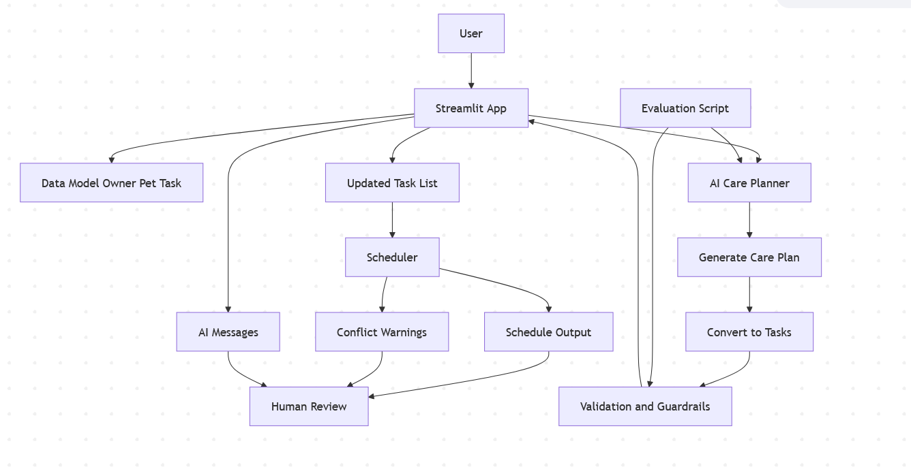

# PawPal+ - AI-Powered Pet Care Planner

## Original Project From Module 2

This project extends my Module 2 PawPal System. The original system allowed users to create pets, assign tasks, and manage schedules using features such as sorting, filtering, recurring tasks, and conflict detection. Its goal was to help pet owners organize daily care activities for their pets.

## Project Summary

PawPal+ enhances the original system by adding an AI-powered care planning workflow. Instead of manually creating all tasks, users can input a goal (for example, exercise or grooming), and the system automatically generates, validates, and integrates a personalized care plan into the pet’s schedule. This reduces the manual effort the user needs to undertake and makes task planning more intelligent.

## Agentic Workflow

The system uses a rule-based agentic workflow that conducts the following:

1. Plan - Generates care recommendations based on pet type and user goal  
2. Act - Converts recommendations into structured tasks  
3. Check - Validates tasks using guardrails (duplicate detection, filtering, adjustments)  
4. Integrate - Adds approved tasks into the system and displays warnings as appropriate

## Architecture Overview

The user interacts with the Streamlit application to input goals and manage pets. These inputs are passed to the AI Care Planner, which generates recommended care actions based on the pet type and user goal. The planner then converts these recommendations into structured tasks.

Before being added to the system, all tasks go through a validation and guardrail stage. Approved tasks are then added to the pet’s task list, where the Scheduler processes them by sorting, filtering, handling duplicates, and detecting conflicts. Then, the system outputs a structured schedule, warnings, and messages, which are displayed to the user.

The evaluation script and the user both act as verification layers. The evaluation script tests system behavior across scenarios, while the user reviews generated tasks and warnings to ensure correctness.

## Setup Instructions

### 1. Clone the repository
git clone https://github.com/xiaoqilee/applied-ai-system-project
cd applied-ai-system-project

### 2. Install dependencies
pip install -r requirements.txt

### 3. Run the app
streamlit run app.py

## Sample Interactions

### Example 1 — Exercise Goal
Input:
Goal: exercise  
Pet: Dog  

Output:
- Daily morning walk for Happy  
- Feed Happy  
- More exercise for Happy  

---

### Example 2 — Grooming Goal
Input:
Goal: groom  

Output:
- Feed Happy  
- Daily morning walk for Happy  
- Groom Happy (scheduled in the future with weekly frequency)  

---

### Example 3 — Duplicate Handling
Input:
Existing task: Feed Happy at 08:00  
Goal: feed  

Output:
- Feed Happy (time adjusted to avoid conflict)  
- Warning: Adjusted duplicate task time for Happy  

## Design Decisions

To form a balance between simplicity, usability, and reliability, several design decisons were made

First, instead of integrating an external large language model a rule-based AI planner was used. This keeps the system lightweight, fast, and easy to run without requiring API keys or internet access. However, the trade-off is that the system is less flexible and cannot handle complex input as well.

Second, planning, validation, and scheduling are in separate components. This modularity makes the system easier to  maintain and test independently. However, this slightly increased the complexity in the code structure.

Third, guardrails were added to improve reliability. The system validates task inputs, filters out irrelevant tasks, and automatically adjusts duplicate tasks to avoid conflicts. This improves correctness and user trust, but it also means that there are stricter rules that may sometimes  reject or modify tasks in ways the user did not expect.

## Testing Summary

I tested the system through unit tests, an evaluation script, and manual testing.

The primary features worked as expected with task creation, completion, sorting, and filtering behaving correctly across different scenarios. The AI planner was also able to make relevant tasks based on user goals, and the validation layer filtered and adjusted duplicates when conflicts occurred. 

Nevertheless, some drawbacks that I observed was that it may not handle more complex or ambiguous user goals. Additionally, frequencies like "bi-weekly" are accepted in the interface but are not truly supported by the scheduling logic.

From testing, I learned the importance of guardrails in AI systems. Without validation, generated tasks could easily conflict or be irrelevant. 

## Reflection

This project helped me understand the process of adding an agentic workflow into a project. Rather than only executing predefined logic, the system can now generate actions based on user goals and then evaluates those actions before applying them. 

One of the most important lessons was the role of guardrails in AI systems. Outputs should always be checked, filtered, and adjusted to ensure they are useful and safe.

I also learned the value of modular design. Separating planning, validation, and scheduling made the system easier to debug and extend. When something did not work as expected, it was easier to identify whether the issue came from and fix it accordingly.

## Reliability Summary

All 20 out of 20 unit tests passed successfully. The planner consistently made  valid tasks for different user goals with duplicate tasks being detected and automatically adjusted

## Portfolio Artifact

GitHub Repository:
https://github.com/xiaoqilee/applied-ai-system-project

### What this project says about me as an AI engineer

This project demonstrates my ability to design and implement an AI-driven system. I built an agentic workflow that generates, validates, and integrates tasks into a working application. It also highlights my focus on reliability and system design. I incorporated guardrails, validation logic, and testing to ensure the system produces consistent and meaningful outputs. 